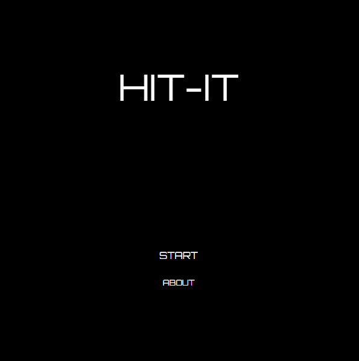

# HIT-IT

[Live Demo](https://briceyokoyama.github.io/hit-it/)

HIT-IT is an "addictive" hit-the-ball towards the target game. Inspired by traditional mini-putt games, HIT-IT adds a the twist of being unwinnable. Compete with friends to see who can get the best combination of low number of clicks and shortest distance to the middle of the target.



## Technologies

HIT-IT is built using JavaScript, HTML Canvas, CSS, and additional HTML5 tags.

## Features

### Collision detection between objects.

An essential aspect of HIT-IT is the ability to detect collisions so that the playball can bounce off of obstacles as well as the borders of the playing field.  
  
The code snippet below is in the ```moving_object.js``` file which handles the interaction between the playball and the game environment.

```javascript
//moving_object.js

collisionLeft(ob) {

  let slope = this.vel[1]/this.vel[0];

  if (ob.angle === 0) {
    let wallDim = ob.pos[0] - ob.width/2;
    let intersectionPT = this.prevPos[1] + slope * (wallDim - this.prevPos[0]);
    let yLowerBound = ob.pos[1] - ob.height/2;
    let yUpperBound = ob.pos[1] + ob.height/2;
    if (this.prevPos[0] < wallDim) {
      if (this.pos[0] > wallDim) {
        if(intersectionPT > yLowerBound && intersectionPT < yUpperBound) {
          this.pos[0] = wallDim;
          this.pos[1] = intersectionPT;
          this.vel[0] = -this.vel[0]
          return true;
        }
      }
    }
  return false;
  } else {
    let wallSlope = (ob.ytopLeftPt - ob.ybottomLeftPt) / (ob.xtopLeftPt - ob.xbottomLeftPt);
    let intersectionX = ((slope*this.pos[0] - this.pos[1]) - (wallSlope*ob.xbottomLeftPt - ob.ybottomLeftPt))/(slope - wallSlope);
    let intersectionY = slope*intersectionX - (slope*this.pos[0] - this.pos[1]);
    let xPrevDiff = this.prevPos[0] - intersectionX;
    let xCurrDiff = this.pos[0] - intersectionX;
    let yPrevDiff = this.prevPos[1] - intersectionY;
    let yCurrDiff = this.pos[1] - intersectionY;

    // if (intersectionY > ob.ytopLeftPt && intersectionY < ob.ybottomLeftPt && xPrevDiff*xCurrDiff <= 0 && yPrevDiff*yCurrDiff <= 0) {
    if (intersectionY > ob.ytopLeftPt && intersectionY < ob.ybottomLeftPt && xPrevDiff*xCurrDiff <= 0 && yPrevDiff*yCurrDiff <= 0) {
      debugger;
      let xAngle = 180 - 2*ob.angle;
      let xComp1 = this.vel[0] * Math.cos(this.getRadians(xAngle));
      let xComp2 = this.vel[0] * Math.sin(this.getRadians(xAngle));

      let yAngle = 90 - 2*ob.angle;
      let yComp1 = this.vel[1] * Math.cos(this.getRadians(yAngle));
      let yComp2 = this.vel[1] * Math.sin(this.getRadians(yAngle));

      this.vel[0] = xComp1 + yComp1;
      this.vel[1] = xComp2 + yComp2;
      this.pos[0] = intersectionX + this.vel[0]*0.01;
      this.pos[1] = intersectionY + this.vel[1]*0.01;
      return true;

    }
    return false;
  }
}
```
This code snippet shows the check for collision between the playball and the left side of an obstacle. A similar function exists for each side of the obstacle and each is checked at each action frame. The function receives an obstacle and uses it's properties to check for a collision. The functioni also calculates the rebound direction and velocity according to the direction and velocity of the playball prior to impact and the angle of the obstacle wall  
  
  ### Game Loop
  
  Another essential aspect of the game is the game loop. This handles the major logical steps of the game during gameplay.
  
  ```javascript
  class GameView {
  constructor(game, ctx, canvasEl) {
    this.ctx = ctx;
    this.game = game;
    this.canvasEl = canvasEl;
    this.doStuff = this.doStuff.bind(this);
    this.handleClick = this.handleClick.bind(this);
  }

  start() {
    this.doStuff();
  }

  handleClick(e) {
    this.game.addClick();
    let rect = e.target.getBoundingClientRect();
    this.game.pb.determineMovement(e.clientX - rect.left, e.clientY - rect.top);
    this.canvasEl.removeEventListener('click', this.handleClick);
  }

  doStuff() {
    this.game.checkCollisions(this.canvasEl, this.ctx);
    this.game.calcDist();
    this.game.draw(this.canvasEl, this.ctx);
    
    if (this.game.pb.move()) {
      this.canvasEl.addEventListener('click', this.handleClick);
    };

    requestAnimationFrame(this.doStuff);
  }
}
  ```
  
 The code snippet above shows the ```GameView``` class which contains some of the major logic in the game. The ```handleClick``` function determines the location of the click relative to the top-left corner of the canvas and uses it to determine the movement of the playball. The ```doStuff``` function checks for collisions between the playball and all obstacles It also redraws the canvas at each frame and recursively calls itself allowing for continuous rerendering of the gameview.
